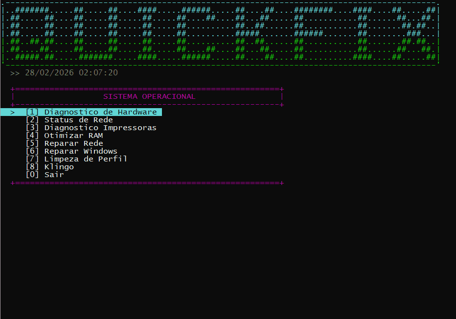

<h1 align="center">QuickFix</h1>

  
  
  

  <strong>Solução Script para Suporte Técnico e Automação de Infraestrutura</strong> 
  <i>Desenvolvido como projeto de conclusão de estágio em T.I. para otimização de fluxos operacionais.</i>

---

## 📺 QuickFix em ação!!!

  

## 📖 Sobre o Projeto
O **QuickFix** é uma ferramenta de terminal interativa desenvolvida para agilizar o atendimento técnico N1 e N2. O projeto foca em consolidar diagnósticos complexos e rotinas de reparo em uma interface unificada, reduzindo o tempo de resposta em ambientes críticos como farmácias e clínicas.

> **Foco Educacional:** Este projeto explora o uso avançado de **PowerShell scripting**, consultas **CIM/WMI**, manipulação de processos via **.NET Interop** e sistemas de auditoria por logs.

---

## 🚀 Módulos Implementados

| Categoria | Funcionalidades |
| :--- | :--- |
| 🖥️ **Hardware** | Mapeamento completo de CPU, RAM, GPU e integridade de armazenamento (SSD/HDD). |
| 🌐 **Rede** | Reset de stack TCP/IP, limpeza de cache DNS, renovação de concessão DHCP e testes de latência. |
| 🖨️ **Impressoras** | Diagnóstico de filas, mapeamento de portas IP e envio de página de teste exclusiva para suporte. |
| 🧠 **Otimização** | Motor de limpeza de memória RAM e aplicação de flags de performance para navegadores. |
| 🛠️ **Reparo OS** | Automatização de rotinas DISM e SFC com interpretação de códigos de saída. |
| ☁️ **Klingo PWA** | Gestão inteligente de cache e reinstalação dinâmica baseada em perfis do Chrome. |

---

## 🔐 Segurança e Auditoria
* **Acesso Autenticado:** Proteção via senha invisível (`-AsSecureString`) para garantir que apenas técnicos autorizados utilizem as ferramentas de reparo.
* **Log de Sessão:** Cada ação executada é documentada em um relatório `.txt` individual, incluindo data, hora e o nome do operador.

---

## 📥 Como Utilizar

### Pré-requisitos
* **Sistema:** Windows 10 ou 11.
* **Privilégios:** Deve ser executado como **Administrador** para funções de sistema.

### Execução
1. Faça o download do arquivo `QuickFix.ps1`.
2. Clique com o botão direito e selecione **"Executar com o PowerShell"**.
3. Insira sua identificação e a chave de acesso (Padrão: `suporte`).

---

## 🛠️ Tecnologias e Conceitos Aplicados
* **ANSI Escaping:** Interface visual com paleta de cores personalizada.
* **WMI/CIM:** Coleta detalhada de informações do sistema operacional.
* **SecureString:** Manipulação segura de credenciais em memória.
* **Error Handling:** Blocos `try/catch` para garantir a resiliência do script.

---

## 👨‍💻 Autor
**Emanoel Peres**
* Estagiário de T.I. em busca de automação e eficiência.
* Especialista em tornar o terminal Windows uma ferramenta poderosa.

---

  <i>"Transformando processos complexos em comandos de um clique."</i>

