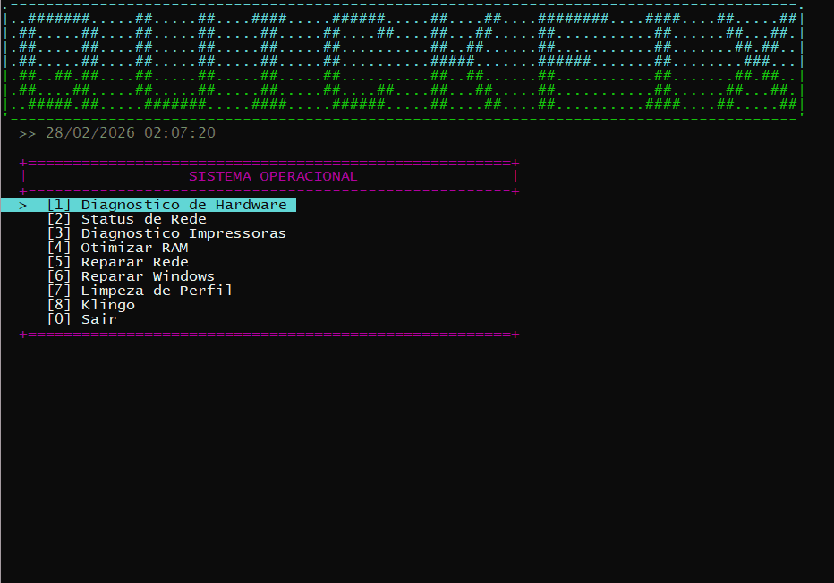

<div align="center">

```
QuickFix, sua solução rápida
```
<p align="center">
  
</p>

**Corporate Support & Diagnostic Script**

[](https://docs.microsoft.com/powershell)
[](https://www.microsoft.com/windows)
[](.)
[](.)
[](LICENSE)

*Desenvolvido por [Emanoel Peres](https://github.com/emanoeI)*

</div>

---

## 📌 Sobre o Projeto

**QuickFIX** é um toolkit PowerShell modular criado para padronizar e agilizar o suporte técnico em ambientes Windows corporativos. O objetivo é eliminar variações no procedimento de atendimento, garantir rastreabilidade total das ações realizadas e reduzir o tempo de resolução de chamados.

O script roda de forma nativa em máquinas Windows, sem necessidade de instalação, e pode ser executado diretamente da memória ou localmente conforme a política de segurança do ambiente.

### Princípios de Projeto

| Princípio | Descrição |
|---|---|
| 🔒 **Segurança** | Nenhuma ação destrutiva executa sem confirmação explícita do técnico |
| 📋 **Rastreabilidade** | Toda sessão gera um relatório `.txt` com nome do técnico, máquina e ações |
| 🧩 **Modularidade** | Cada módulo é isolado e pode ser executado de forma independente |
| ⚡ **Agilidade** | Interface de menus navegáveis por seta, sem necessidade de digitar comandos |

---

## ⚙️ Arquitetura Técnica

QuickFIX é composto por **8 módulos independentes** acessados via menu numérico com navegação por teclado. Cada módulo opera em isolamento para reduzir o risco operacional.

### Fluxo de Execução

```
┌─────────────────────────────────────────┐
│           INICIALIZAÇÃO                 │
│  1. Identificação do técnico            │
│  2. Autenticação por senha              │
│  3. Registro de início de sessão        │
│  4. Criação do arquivo de log           │
└──────────────────┬──────────────────────┘
                   │
       ┌───────────▼───────────┐
       │      MENU PRINCIPAL    │
       │  Navegação por setas   │
       └───────────┬───────────┘
                   │
    ┌──────────────┼──────────────┐
    ▼              ▼              ▼
[Módulo 1-8]  [Submenu]    [Encerrar]
    │                            │
    ▼                            ▼
[Ação com              [Fechar relatório]
 confirmação]          [Salvar log]
    │
    ▼
[Relatório automático]
```

---

## 🔎 Módulos Operacionais

### `[1]` Diagnóstico de Hardware
Coleta informações do sistema de forma **somente leitura**. Nenhum dado é modificado.

- Sistema operacional, versão e build
- Processador, número de cores e fabricante da placa-mãe
- Módulos de RAM com capacidade e velocidade por slot
- Controladores de vídeo e versão de driver
- Discos com detecção automática de tipo (SSD/HDD), espaço livre e alertas por threshold

---

### `[2]` Status de Rede
Diagnóstico completo de conectividade do adaptador ativo.

- IP privado, DHCP e servidores DNS
- Teste de gateway e conectividade com a internet
- Consulta de IP público e provedor via `ip-api.com`
- Teste de latência (ping médio com 4 amostras)
- Teste de velocidade via **Ookla Speedtest CLI** com barra de progresso em tempo real

---

### `[3]` Diagnóstico de Impressoras *(submenu interativo)*

| Opção | Ação |
|---|---|
| Status e fila de jobs | Lista todas as impressoras e jobs pendentes |
| Mapeamento de portas e IPs | Exibe IP e porta configurada por impressora |
| Teste de comunicação (ping) | Testa conectividade TCP/IP com o IP da impressora |
| Reiniciar Spooler | Para e reinicia o serviço Spooler com confirmação |
| Limpar fila travada | Remove jobs travados em `spool\PRINTERS` com confirmação |
| Definir impressora padrão | Lista e permite alterar a impressora padrão do sistema |
| Enviar página de teste | Gera e envia folha de teste formatada com dados da sessão |
| Forçar impressora online | Remove flag de offline sem reinstalar o driver |

---

### `[4]` Otimização de RAM *(submenu interativo)*

| Opção | Técnica Utilizada |
|---|---|
| Limpeza Geral | `EmptyWorkingSet` + `SetProcessWorkingSetSize` via `psapi.dll` + limpeza de cache do Chrome/Edge |
| Limpeza Cirúrgica Chrome/Edge | Aplica Mem-Reduct apenas em processos acima de 100MB **sem fechar o navegador** |
| Flags de Economia no Chrome | Modifica atalho do Chrome com `--enable-aggressive-tab-discard` para descarte automático de abas inativas |

---

### `[5]` Reparo de Rede *(submenu interativo)*

| Opção | Comandos Executados |
|---|---|
| Reparo Completo | `ipconfig /release` → `/flushdns` → `/renew` → `netsh winsock reset` → `/registerdns` |
| Limpar Cache DNS | `ipconfig /flushdns` |
| Testar Conectividade | Ping gateway + ping `8.8.8.8` + resolução DNS `google.com` |
| Resetar Adaptador | `Disable-NetAdapter` + `Enable-NetAdapter` nos adaptadores ativos |

---

### `[6]` Reparo do Windows

Sequência completa de reparo de arquivos do sistema com leitura do exit code real de cada operação.

```
DISM /Online /Cleanup-Image /RestoreHealth
SFC /Scannow
DISM /Online /Cleanup-Image /StartComponentCleanup
```

Cada etapa retorna o veredito baseado no exit code (sucesso, reparos realizados, reinício necessário, falha).

> ⚠️ Processo pode levar de 10 a 20 minutos. Requer reinicialização para aplicar correções.

---

### `[7]` Limpeza de Perfil *(submenu interativo)*

| Opção | Caminho |
|---|---|
| Temp do Usuário | `%TEMP%` e `%LOCALAPPDATA%\Temp` |
| Temp do Sistema | `C:\Windows\Temp` |
| Prefetch | `C:\Windows\Prefetch` |
| Limpeza Completa | Todos os caminhos acima em sequência |

Todas as opções calculam e exibem o espaço antes/depois/liberado.

---

### `[8]` Klingo *(submenu interativo)*

Módulo específico para gerenciamento do app PWA Klingo instalado via Chrome.

- **Reinstalar**: Desinstala a versão atual via registro + reabre o Chrome no perfil correto com guia passo a passo
- **Limpar Cache**: Fecha o Chrome, limpa cache, LocalStorage, IndexedDB e Service Worker do perfil do Klingo
- **Seleção de Perfil**: Lista perfis do Chrome disponíveis na máquina (`Default`, `Profile 1`, etc.)

---

## 📄 Sistema de Relatórios

Cada sessão gera um único arquivo `.txt` em:

```
C:\services\relatorios\{NomeTecnico}\sessao_ddMMAAAA_HHmmss.txt
```

**Estrutura do relatório:**

```
====================================================
  RELATORIO DE SESSAO - QUICKFIX
====================================================
  Inicio     : 01/03/2026 09:15:42
  Tecnico    : João Silva
  Maquina    : DESKTOP-ABC123
  IP         : 192.168.1.105
====================================================
  ACOES REALIZADAS
====================================================
----------------------------------------------------
  [01/03/2026 09:16:10]
  Opcao    : Diagnóstico de Hardware
  Detalhe  : CPU, RAM, GPU, Disco
  Resultado: CPU: Intel Core i5-10400 | RAM: 8GB | ...
----------------------------------------------------
====================================================
  FIM DA SESSAO
====================================================
  Inicio      : 01/03/2026 09:15:42
  Encerramento: 01/03/2026 09:48:03
  Tecnico     : João Silva
  Maquina     : DESKTOP-ABC123
====================================================
```

---

## ▶️ Formas de Execução

Escolha o método adequado à política de segurança do ambiente:

### Método 1 — Direto na memória *(proxy-friendly)*
```powershell
$wc = New-Object Net.WebClient
$wc.Proxy.Credentials = [Net.CredentialCache]::DefaultNetworkCredentials
IEX $wc.DownloadString('https://raw.githubusercontent.com/emanoeI/QuickFIX/main/QuickFIX.ps1')
```

### Método 2 — Download e execução local *(auditável)*
```powershell
$wc = New-Object Net.WebClient
$wc.Proxy.Credentials = [Net.CredentialCache]::DefaultNetworkCredentials
$wc.DownloadFile('https://raw.githubusercontent.com/emanoeI/QuickFIX/main/QuickFIX.ps1', 'QuickFIX.ps1')
powershell -ExecutionPolicy Bypass -File .\QuickFIX.ps1
```

### Método 3 — Via Invoke-RestMethod
```powershell
powershell -ExecutionPolicy Bypass -Command "iex (irm https://raw.githubusercontent.com/emanoeI/QuickFIX/main/QuickFIX.ps1)"
```

### Método 4 — Com verificação de hash SHA256 *(enterprise-safe)*
```powershell
$wc = New-Object Net.WebClient
$wc.Proxy.Credentials = [Net.CredentialCache]::DefaultNetworkCredentials
$wc.DownloadFile('https://raw.githubusercontent.com/emanoeI/QuickFIX/main/QuickFIX.ps1', 'QuickFIX.ps1')
$hash = Get-FileHash .\QuickFIX.ps1 -Algorithm SHA256
if ($hash.Hash -eq 'INSIRA_O_HASH_SHA256_OFICIAL') {
    powershell -ExecutionPolicy Bypass -File .\QuickFIX.ps1
} else {
    Write-Host "ERRO: Hash do arquivo divergente. Execução abortada."
}
```
> 💡 Substitua `INSIRA_O_HASH_SHA256_OFICIAL` pelo hash verificado do script original.

---

## 📋 Requisitos

| Requisito | Mínimo |
|---|---|
| Sistema Operacional | Windows 10 ou superior |
| PowerShell | 5.0 ou superior |
| Privilégios | Administrador local |
| Política de Execução | `Bypass` (passado como parâmetro de execução) |
| Conectividade | Necessária apenas para módulos de rede e download do Speedtest |

---

## 🗂️ Estrutura do Projeto

```
QuickFIX/
├── QuickFIX.ps1        # Script principal
├── README.md           # Documentação
└── LICENSE             # Licença MIT
```

---

## 🔐 Notas de Segurança

- O script **não persiste** dados além dos relatórios em `C:\services\relatorios`
- Nenhuma informação é transmitida para servidores externos, exceto:
  - Consulta de IP público via `ip-api.com` (módulo de rede, apenas quando online)
  - Download do Speedtest CLI via `install.speedtest.net` (módulo de rede, temporário)
- O binário do Speedtest é **removido automaticamente** após o teste
- Todas as ações com potencial de impacto exigem confirmação `S/N` antes de executar

---

## 📝 Licença

Distribuído sob a licença MIT. Consulte o arquivo [LICENSE](LICENSE) para mais detalhes.

---

<div align="center">

Desenvolvido com 🖤 por **Emanoel Peres**

*QuickFIX — porque suporte bom é suporte rápido, rastreável e padronizado.*

</div>
